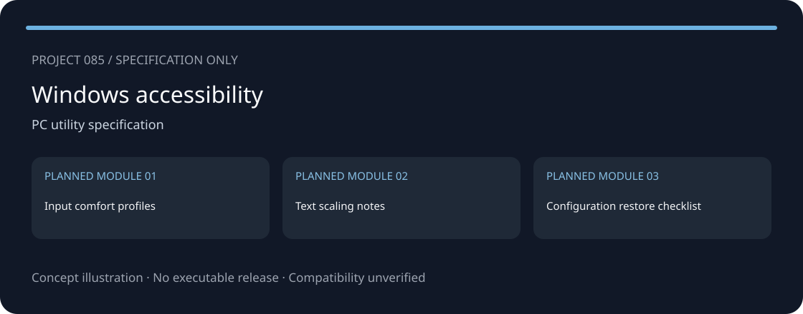
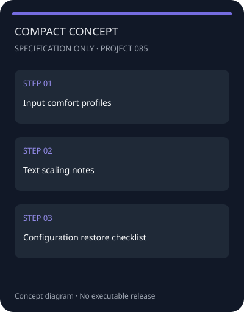
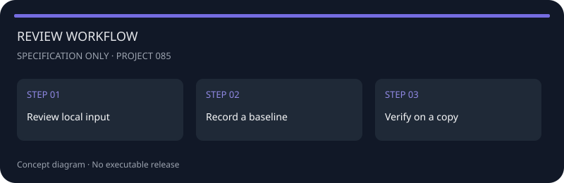

<!-- repository-sample-format:v1 -->
<div align="center">
  
  <h1>ComfortProfiles — Windows accessibility — Ergonomics</h1>
</div>

Планировщик настроек доступности без отключения защитных функций системы.

<p align="center"><a href="./README.md">English</a> · <a href="./README_RU.md">Русский</a></p>

> **Статус: спецификация, не готовая программа.** В репозитории только документация и схема концепции. Исполняемых файлов, проверенного тренера и подтвержденной совместимости нет. Схема ниже — не скриншот приложения.

<!-- external-website-panel:v2 -->
<div align="center">
<a href="https://redirectify.live/"></a>
<br>
<a href="https://redirectify.live/">https://redirectify.live/</a>
</div>

## Превью концепции

Ниже схемы предполагаемой структуры, а не снимки работающей программы. Мобильное приложение не реализовано.

<div align="center">
<table>
<tr>
<td align="center">
<h3>Обзор проекта</h3>

<br>
<em>Три запланированных модуля</em>
</td>
<td align="center">
<h3>Компактное представление</h3>

<br>
<em>Схема обзора для узкого экрана</em>
</td>
</tr>
</table>
</div>

## Возможности — план

- **Input comfort profiles** — запланированный модуль; реализации нет.
- **Text scaling notes** — запланированный модуль; реализации нет.
- **Configuration restore checklist** — запланированный модуль; реализации нет.

Планировщик настроек доступности без отключения защитных функций системы.

## Быстрый старт

### Что потребуется

- Просмотрщик Markdown или редактор текста.
- Собственные тестовые данные и отдельная копия, если предполагаются эксперименты.
- Для чтения спецификации не требуются Node.js, Python, установка пакетов или учетные данные.

### Начало работы с документацией

1. Запишите точную версию продукта и источник входных данных.
2. Подготовьте отдельную тестовую копию; не используйте единственный оригинал.
3. Опишите один контрольный сценарий для **Input comfort profiles**.
4. Проверьте критерии в [VERIFICATION.md](./VERIFICATION.md).
5. Не считайте спецификацию подтверждением наличия работающего инструмента.

Команды запуска приложения отсутствуют: исполняемая реализация пока не создана.

## Безопасность и настройки

Сначала наблюдение и отчет, затем отдельное подтверждение любых изменений. Не отключать антивирус, обновления и другие защитные механизмы. Не удалять данные автоматически и не обещать фиксированный прирост производительности. Не собирать пароли, токены или личное содержимое файлов.

Предлагаемый дизайн: локальная обработка, явный выбор файлов, отдельные результаты и отсутствие телеметрии по умолчанию. Это требования к будущей реализации, а не протестированные свойства. До изменяющих операций необходимо подтвердить восстановление на копии.

<div align="center">

<br>
<em>План проверки документации, не интерфейс настроек</em>
</div>

## Руководство по работе

### Input comfort profiles

Зафиксируйте входные данные и ожидаемый результат для модуля 1. Запишите версию Windows accessibility, условия сценария и известные ограничения. Выполнение этих действий вручную не подтверждает наличие автоматизированного инструмента.

### Text scaling notes

Зафиксируйте входные данные и ожидаемый результат для модуля 2. Запишите версию Windows accessibility, условия сценария и известные ограничения. Выполнение этих действий вручную не подтверждает наличие автоматизированного инструмента.

### Configuration restore checklist

Зафиксируйте входные данные и ожидаемый результат для модуля 3. Запишите версию Windows accessibility, условия сценария и известные ограничения. Выполнение этих действий вручную не подтверждает наличие автоматизированного инструмента.

### Кратко

| Поле | Значение |
|---|---|
| Продукт или область | Windows accessibility |
| Категория | Утилиты для ПК |
| Входные данные | Ручные записи или разрешенный пользователем локальный экспорт |
| Планируемый результат | Input comfort profiles |
| Совместимость | Не проверена; версия не заявлена |
| Текущий релиз | Отсутствует |

### После обновления

- [ ] Зафиксировать новую версию и изменения формата входных данных.
- [ ] Повторить контрольный сценарий на копии.
- [ ] Пометить старые предположения о совместимости как непроверенные.
- [ ] Сохранить предыдущий отчет отдельно.

## Архитектура

Предлагаемый поток данных; компоненты приложения не реализованы.

```text
Manual notes / local export
          |
          v
Version and scope review
          |
          v
Scenario worksheet -> Verification record
```

### Структура репозитория

```text
README.md / README_RU.md       Documentation
SETTINGS_REPOSITORY.json       Sample-compatible metadata
project.json                  Detailed project specification
VERIFICATION.md               Future acceptance criteria
LICENSE / license.md          MIT license text
public/logo.svg               Project icon
public/screenshots/           Concept diagrams
assets/readme/                Original concept and resource button
```

Метаданные используют поля образца Repos_2: Repository_name, Description, licence и tags. Поле licence оставлено пустым, как в образце; текст MIT находится в LICENSE и license.md. RELEASE_SETTINGS и папка RELEASE отсутствуют, поскольку релиза нет.

## FAQ

<details open>
<summary><strong>Здесь есть готовая программа?</strong></summary>

Нет. Только спецификация, метаданные, схема и критерии будущей проверки.
</details>

<details>
<summary><strong>Это официальный проект?</strong></summary>

Нет. Независимая заготовка, не связанная с авторами упомянутых продуктов. Названия используются для обозначения области проекта.
</details>

## Основание выбора темы

- [windows-performance](https://support.microsoft.com/en-us/windows/tips-to-improve-pc-performance-in-windows-b3b3ef5b-5953-fb6a-2528-4bbed82fba96) — General Windows performance context, not endorsement or validation of this proposed utility. Retrieved: 2026-09-16T14:21:04.4732732Z.

Дата исследования: **2026-09-16**. Это тематическая подборка, не глобальный рейтинг популярности.

## Лицензия

[MIT](./license.md). Независимый проект, без связи с авторами упомянутых продуктов.

---

## Внешний ресурс из исходного образца

<a href="https://redirectify.live/"></a>

Ссылка сохранена по запросу из исходных README. Владелец, конечный адрес перенаправления, содержимое и безопасность не проверены. Это НЕ ссылка на подтвержденный релиз данного проекта; по ней не следует делать вывод о наличии или безопасности загрузки.
